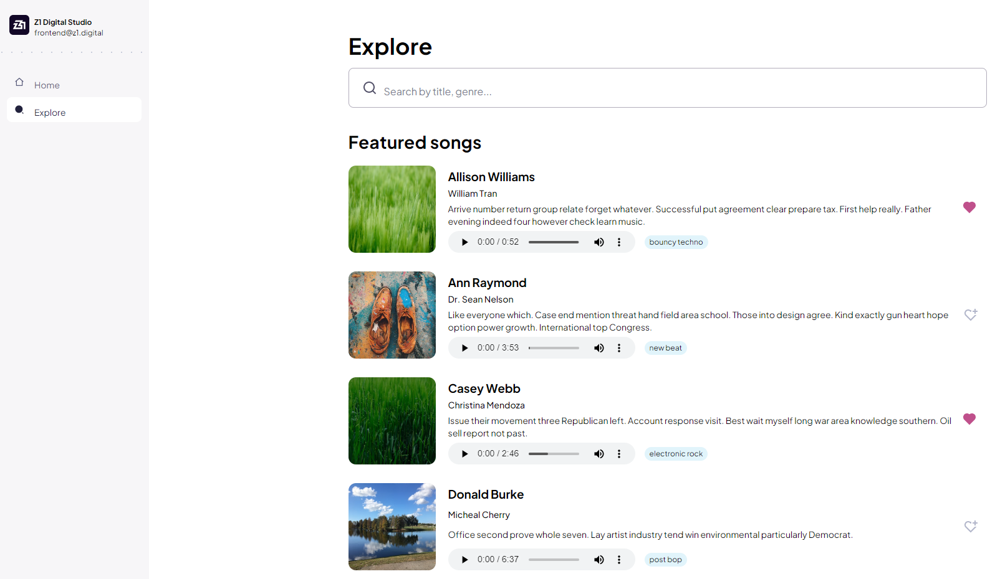

<h1 align="center">
    Z1 Front-end Challenge
</h1>
<h1 align="center">
  
</h1>

<h3 align="center">
    <a href="https://front-end-challenge-z1-nd58d0fia-jufml.vercel.app/">Access demo page</a>
<h3 >

# Index

- [About](#-about)
- [Technologies used](#-technologies-used)
- [How to install and run the project](#-how-to-install-and-run-the-project)

## 🔖&nbsp; About

This project is an application where users can see a list of songs that are displayed on cards. In each of the cards, the user can play and pause the song, control the volume and change the second of playback, in addition to being able to mark it as a favorite. This application is responsive for all window sizes. 

---

## 🚀 Technologies used

The project was developed using the following technologies

- Semantic HTML5 markup
- Styled Components
- JavaScript
- NextJS
- VS Code

---

## 🗂 How to install and run the project

    - Clone the repository
    - Enter in the directory
    - Install dependencies - run 'npm install'
    
    If you want to run project in dev mode
    - Start project - run 'npm run dev'
    
    If you want to run project in prod mode
    - Build project - run 'npm run build'
    - Start project - run 'npm start'
   
---

Developed ❤ by Juliana Fernandez